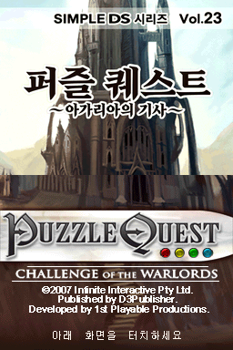
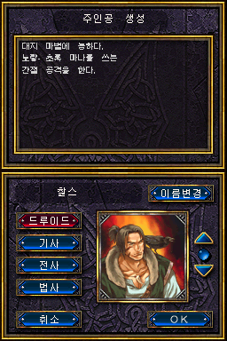
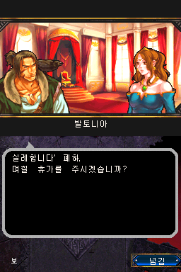
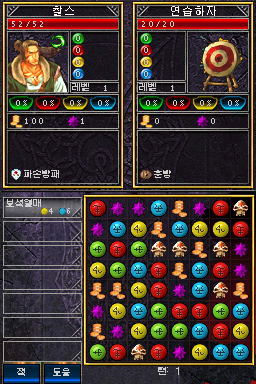

# 퍼즐 퀘스트: 챌린지 오브 더 워로드
### Puzzle Quest: Challenge of the Warlords — NDS 한국어 패치

**NDS · 일본판 기반 · 한국어 패치 완료**

*퍼즐과 RPG가 만나는 판타지 모험을 한국어로 즐겨보세요.*

---

## 🎮 게임 소개

**퍼즐 퀘스트: 챌린지 오브 더 워로드**는 매치 3 퍼즐 전투와 캐릭터 육성, 장비, 마법, 퀘스트를 결합한 판타지 퍼즐 RPG입니다. 보석을 맞춰 마나를 모으고 기술을 사용하면서 모험을 진행합니다.

| 항목 | 내용 |
| --- | --- |
| 게임 | Puzzle Quest: Challenge of the Warlords |
| 플랫폼 | Nintendo DS (NDS) |
| 패치 기준 | 일본판 |
| 장르 | 퍼즐 RPG |
| 메타크리틱 | **82/100** (NDS판, 전문가 평가 41건) |
| 한국어 패치 | 완료 |

> 메타크리틱 평점은 원작 NDS 버전에 대한 평가이며, 한국어 패치 자체의 평점이 아닙니다.

## 🇰🇷 한국어 패치 소개

이 프로젝트는 **NDS 일본판 원본 ROM**을 기반으로 한국어로 즐길 수 있도록 제작한 비공식 팬 번역 패치입니다.

**한글화된 항목**
- 메뉴 및 인터페이스
- 대사와 퀘스트
- 각종 설명
- 전투 알림
- 일부 이미지
- 시스템에 표시되는 게임명

**패치 버전:** `v0.9.0` (현재 저장소의 배포 파일 기준)  
**배포 파일명:** `PuzzleQuest_NDS_KO_v0.9.0.zip`

## 🖼️ 스크린샷

| 인트로 | 캐릭터 생성 |
| :---: | :---: |
|  |  |
| 대사 | 전투 |
|  |  |

## 📦 패치 적용 방법

1. 일본판 원본 ROM을 준비합니다.
2. 원본 ROM의 SHA-256이 아래 BASE 값과 같은지 확인합니다.
3. 배포 ZIP에 포함된 패치를 **xdelta3**로 적용합니다.
4. 완성 ROM의 SHA-256을 아래 값과 비교합니다.
5. 정상적으로 일치하면 즐겨주세요!!

**SHA-256**
- BASE: `0d0c188dfb4b589864cb32a1753eba23c237739547e1075b8f742cbae1e3643e`
- 완성 ROM: `73820f2bd053cba749d6d9ca69111d83847e7ec725e47d9cf3becdbd14d20e39`
- 패치: `54991522031f3c38de62d270f47376c1fd6e1a5fa046779341038267c6c5afe6`

## 🔎 PSP와 NDS 버전

PSP와 Nintendo DS 버전은 같은 게임을 기반으로 하며, 두 플랫폼의 한국어 패치 모두 완료되었습니다. 플랫폼별 원본 파일과 패치 적용 정보는 각 저장소에서 확인하세요.

- **NDS:** 일본판 ROM 기반 xdelta3 패치
- **PSP:** 일본판 ISO 기반 xdelta3 패치

[PSP 한국어 패치 프로젝트](https://github.com/YourFaceMonster/puzzle-quest-psp-korean-patch)

## ⚠️ 주의사항

- 이 저장소는 **비공식 팬 번역 프로젝트**이며 원작 개발사 및 배급사와 관계가 없습니다.
- 게임 본편(ROM)은 배포하지 않습니다. 패치 적용에는 사용자가 보유한 일본판 원본이 필요합니다.
- 다른 지역판이나 다른 해시의 ROM에 대한 호환성은 보장하지 않습니다.

## 🙏 크레딧

**한글화: YFM.**

원작의 개발진과 퍼즐 퀘스트를 즐기는 모든 분들께 감사드립니다.

---

Unofficial Korean translation patch · Nintendo DS

